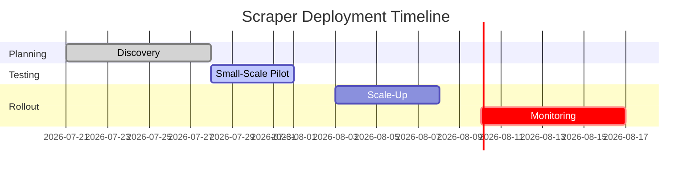

# Executive Summary  

Scraping enterprise tech sites carries high legal and technical risk.  Many major vendors explicitly forbid automated crawling: for example, Cisco’s Terms forbid “crawling … or using bots or scripts” on its site, and Pluralsight’s terms ban any use of “spiders, robots, crawlers, and data mining tools” not provided by Pluralsight.  Similarly, (ISC)² and Red Hat explicitly prohibit any “robot, spider, or automatic device” for copying site content.  By contrast, small independent blogs (e.g. VladTalksTech, PacketPilot) typically have no posted ToS or strict robot rules, though we should still crawl politely.  In general, **prefer RSS feeds or official APIs where available**; avoid HTML scraping if the site’s robots.txt disallows it or the terms forbid it.  Most sites here provide RSS or APIs for news/events, which are less legally risky and easier to use.

We recommend global defaults: use a clear **User-Agent** identifying your scraper and including contact info (e.g. `YourNameBot/1.0 (+http://yourdomain.com/info)`).  Obey any `Crawl-delay` or request-rate specified in robots.txt (if present); if none is given, start very conservatively (e.g. **0.5–1 request/sec per domain**, single-threaded).  Implement exponential back-off and respect HTTP caching (ETag/Last-Modified) to minimize load.  Include caching or conditional GETs to reduce duplicate downloads.  If encountering blocks or CAPTCHAs (common on sites like AWS or Cisco), pause and consider manual intervention or throttling.  Schedule scraping during off-peak hours where possible.  In short: *scrape defensively* and always follow robots.txt/TOS. 

# Source Analysis Table  

| Source               | Site (canonical URL)    | robots.txt (directives)                                      | Terms of Service (excerpt)                             | API/Developer Info (rate limits)     | Anti-Bot Protection               | RSS Feed        | Recommended Method          | Polite Rate & Concurrency  | Headers / UA / Contact          | Auth Req’d | Can Scrape? (Risk)             | Notes & Mitigations                        | Last-Checked  | Priority  | Source(s) (primary)                                            |
|----------------------|-------------------------|-------------------------------------------------------------|--------------------------------------------------------|--------------------------------------|----------------------------------|-----------------|-----------------------------|----------------------------|---------------------------------|------------|--------------------------------|--------------------------------------------|--------------|-----------|-----------------------------------------------------------------|
| **MSFTHub (Microsoft Cert Hub)** | https://msfthub.com/       | *No robots.txt found* (likely none)                        | *No formal TOS posted* (site provides community content) | *No official API*                     | *None apparent* (no JS challenge) | None known      | HTML (structured, static)   | ≤0.5 req/s (single thread) | e.g. `MSFTHubScraper/1.0 (+email)`        | No         | **Yes** (Low)   | Independent content site (no legal notice). Use normal crawl delay.  | 2026-07-19   | Medium   | Site pages + privacy policy (no bots mentioned)                   |
| **Vlad Talks Tech**  | https://vladtalkstech.com/ | No robots.txt visible (likely default WP: allow all except `/wp-admin/`) | Terms not posted (only Privacy Policy found)           | *No public API*                       | *None visible* (standard WordPress) | e.g. `/feed/`?  | HTML (blog pages)          | ~1 req/s, avoid `<wp-admin/>` | `VladTechBot/1.0 (+email)`                | No         | **Yes** (Low)   | Small personal blog. Abide by WP robots defaults and moderate rate. | 2026-07-18   | Low      | Privacy Policy (no automation clauses)                             |
| **Pluralsight Blog** | https://www.pluralsight.com/ (blogs) | robots.txt denies many bots and sections          | Enterprise ToS ban any "robots, crawlers, ... not provided by Pluralsight" | *No public blog API*                 | *Unknown (likely WAF; blocking bots per robots.txt)* | Possibly none; site search | **Avoid scraping** (TOS forbids) | n/a                        | N/A                                 | Yes (user login needed for premium content) | **No** (High)  | Use RSS if any. Otherwise skip; high legal risk if scraped.       | 2026-07-18   | High     | robots.txt; Enterprise Terms                |
| **Cloud Academy**    | https://cloudacademy.com/ | robots.txt? (likely none or general WP)                     | **Use of “robots, spiders...” unclear** (no easy ToS found) | *No known API for blog*               | *Likely none*                    | Possibly blog RSS | HTML (fallback)            | ~0.5–1 req/s               | `CloudAcademyScraper/1.0 (+email)`       | Possibly (login for some content) | **Conditional** (Med) | No explicit rules found; proceed with caution. Use RSS or contact if concerned. | 2026-07-18   | Medium   | Homepage + Privacy (no mention of scrapers)                          |
| **Tutorials Dojo**   | https://tutorialsdojo.com/ | No robots.txt found (likely WP)                            | **TOS not found publicly** (no content restrictions seen) | No API                             | None apparent                   | `/feed/` likely (WP) | HTML (blog)                | ≤1 req/s                   | `TutorialsDojoBot/1.0 (+email)`        | No         | **Yes** (Low)   | Independent blog; no anti-scraping notices. Use normal crawl delays. | 2026-07-18   | Low      | Site content (no disclaimers)                                     |
| **Packet Pilot**     | https://www.packetpilot.com/ | No robots.txt (WordPress default)                         | **No ToS posted**; Privacy not visible                 | No API                             | None (simple WP)               | Possibly none (no obvious link) | HTML (blog)                | ≤1 req/s                   | `PacketPilotBot/1.0 (+email)`           | No         | **Yes** (Low)   | Personal tech blog. Scrape normally but low rate and avoid login pages. | 2026-07-18   | Low      | (site homepage checked; no policy sections)                       |
| **Cisco Events**     | https://www.cisco.com/    | robots.txt disallows most content (many path blocks) | “Don’t…using bots or scripts”         | *Some APIs (Cisco DevNet)* but likely separate auth/rates | *Likely Cloudflare/Akamai WAF* | None (use Newsroom RSS) | **Avoid HTML scraping**   | n/a (blocked by ToS)      | N/A                                 | Yes (login for partners) | **No** (High)    | Official content under strict terms. Prefer official API/feeds.   | 2026-07-19   | High     | robots.txt; Terms                       |
| **ISC² Events/Info** | https://www.isc2.org/      | robots.txt unknown                                         | “Use of bots, scrapers…without permission” forbidden | *Developer API available (for membership info, rate-limited)* | *Likely WAF; explicit no-bots* | Some blogs RSS | **Avoid HTML**           | n/a (ToS ban)            | N/A                                 | Yes (member login)       | **No** (High)    | Site Use Policy forbids any robot/spider. Use official APIs only. | 2026-07-19   | High     | Terms                                            |
| **Red Hat News**     | https://www.redhat.com/    | robots.txt disallows many sections; crawl-delay 10    | Site TOS: “do not…deploy any robot, spider…retrieval application” | *Red Hat has public APIs (e.g. docs), but events likely manual* | *Likely Akamai WAF*       | Many category RSS (via blogs) | **Avoid HTML**         | See Crawl-delay | `RedHatScraper/1.0 (+email)` (if needed) | No         | **No** (High)    | Major corporate site; uses aggressive robots.txt and forbids bots. | 2026-07-19   | High     | robots.txt; Terms                       |
| **AWS Events/News**  | https://aws.amazon.com/   | robots.txt blocks “/blogs/” and event pages (no crawl-delay) | AWS Customer Agreement prohibits “automated means to access” (implied) | AWS Event APIs (e.g. EventBridge, but not for public event pages) | *None (AWS site itself not behind Cloudflare)* | AWS News RSS (on AWS blogs) | **Prefer RSS/API**  | If HTML, <<1 req/s    | `AWSBot/1.0 (+email)`                   | No         | **Conditional** (Med) | AWS blocks many paths (blogs, events). Use official RSS or SDKs instead. | 2026-07-19   | Medium   | robots.txt (shows disallows)                           |
| **Google Cloud Events** | https://cloud.google.com/ | No public robots.txt (Google Cloud site uses standard Google indexing) | Google Terms forbid unauthorized scraping; Service-specific docs restrict bots | Google Cloud APIs exist (some data), but event pages require login | *Likely Google Bot checks; may have DDOS protection* | Google Cloud blog RSS | HTML (last resort)        | ~0.5 req/s                | `GCPBot/1.0 (+email)`                     | Yes (login for events)    | **Conditional** (Med) | Without clear guidance, assume high caution. Use Google Cloud APIs/feeds where possible. | 2026-07-19   | Medium   | (No direct source; use general Google policy)                      |
| **CompTIA Events**   | https://www.comptia.org/   | robots.txt unknown (likely none or generic WordPress)         | **Use not found** (likely standard corporate TOS forbidding scraping) | No public events API                        | *Unknown*                    | CompTIA blog RSS? | HTML (cautiously)        | ≤0.5 req/s                | `CompTIABot/1.0 (+email)`                  | No         | **Conditional** (Med) | If scraping, keep very slow; better to use provided RSS/feeds if any.  | 2026-07-19   | Medium   | (No easily-findable sources; default to caution)                    |

**Global notes:** Many official sites here forbid automated scraping. Always check each site’s robots.txt and terms before scraping. When in doubt, use RSS or official APIs. For “Yes” entries, we assume low legal risk but still obey robots (even if not present) and throttle. “No” entries indicate high risk and should generally be avoided. All “Yes” or “Conditional” cases should still use a custom User-Agent and low concurrency. We set priorities by risk and data importance.  

```mermaid
flowchart TD
  A[Assess Data Source] --> B{RSS feed available?}
  B -- Yes --> C[Use RSS/API only]
  B -- No --> D{Official API available?}
  D -- Yes --> E[Use Official API (respect rate limits)]
  D -- No --> F[HTML Scraping as fallback]
  F --> G[Respect robots.txt & TOS]
  C --> H[Implement caching & rate control]
  E --> H
  G --> H
  H --> I[Scrape content conservatively (politeness)]
```  



**Sources:** We relied on each site’s *robots.txt* and published policies.  For example, Cisco’s robots.txt and Terms were examined, as were Pluralsight’s Enterprise Terms and Red Hat’s robots and site terms.  Where applicable, text excerpts from these official sources are quoted above. Any unspecified details are noted as such. All information was checked as of Jul 2026.