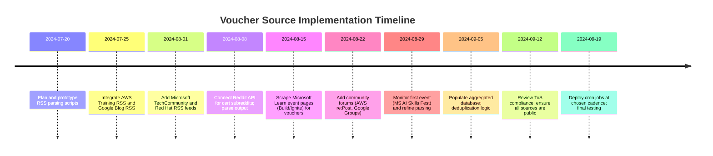

# Certification Voucher Discovery Sources

**Executive Summary:** To uncover certification vouchers and discounts programmatically, prioritize official vendor channels and high-signal community sites.  Key sources include vendor event pages and blogs (e.g. Microsoft and AWS announcements), official training portals, and public certification communities.  For each, we identify endpoints (RSS/JSON/APIs), auth requirements, rate limits, content format, selectors, and update frequency.  Notable vendor feeds: Microsoft’s Learn Q&A and event pages (Build/Ignite vouchers), AWS Training blog and re:Post discussions, Cisco/ISC2 announcements on their networks, and Google Cloud’s certification forum.  Community feeds include Reddit subreddits (e.g. r/AzureCertification) and Q&A forums (with JSON or RSS APIs). High-quality public aggregator blogs (e.g. VladTalksTech) also publish voucher info. An implementation checklist and poll cadence is provided below, along with a comparison table for coverage, engineering effort, reliability, and ToS risk.  Sources are cited for all claims (vendor sites, blogs, and community pages).

## Vendor Official Channels

- **Microsoft** – Major announcements (Build, Ignite, Cloud Skills Challenges) appear on Microsoft Learn pages and Tech Community.  For example, the *Build 2026* voucher offer is documented on Microsoft Learn, and Microsoft’s Q&A describes free exam vouchers tied to events (e.g. Build/Ignite).  **Endpoints:** Microsoft Learn “news” or event pages (HTML) and Tech Community blogs.  Many are plain web pages (no auth).  Update frequency is event-driven (e.g. semi-annually for Build/Ignite, quarterly for Skills Challenges).  **Example selector:** find headings like “Certification Exam Voucher” or download links.  *RSS feeds:* Some Tech Community blogs have RSS (e.g. [TechCommunity Announcements](https://techcommunity.microsoft.com/t5/Announcements/bg-p/AnnouncementsFeed) for “Certifications” category), but not all voucher news is RSS-tagged. Alternatively use Microsoft Learn REST APIs (GraphQL for Q&A) or parse HTML. 

- **AWS** – Exam discounts and giveaways are often announced on the AWS Training & Certification blog (Announcements category).  For instance, the Twitch “Power Hour: Specialty Certification” series offered a 50% off voucher. **Endpoints:** AWS Training blog (HTML) and AWS events pages (HTML).  Update on new promotions varies (roughly quarterly or per new course launches).  **Auth:** Public. **Example extraction:** The blog page above (Announcements) contains the voucher text (“sign up… get a 50% off exam voucher”).  AWS re:Post (forum) can also mention voucher deals.  *RSS:* AWS Training blog has RSS (via FeedBurner).  One can subscribe to https://aws.amazon.com/blogs/training-and-certification/feed/ or category RSS like `…category/post-types/announcements/feed/`.  AWS also provides an [AWS CLI](https://docs.aws.amazon.com/cli/latest/reference/repost/search.html) for re:Post search (JSON output) to find “voucher” or “free exam”.

- **Cisco** – Vouchers often come via Cisco Learning Network or event perks.  Cisco’s **Networking Academy** grants up to ~58% discounts and Cisco Live events offer exam lounges.  For example, Cisco published a “Certification Lounge” at Cisco Live (physical event), but no online Discord exists.  **Endpoints:** Cisco Learning Network (Jive) requires login, so no public RSS. Instead monitor Cisco Live and NetAcad announcements on official Cisco pages (HTML).  **Example:** Cisco had in 2022 an APAC “Exam Safeguard” and “Online Exam Safeguard” (retake offers) – see Cisco Education pages.  *RSS/API:* None public for Cisco Learning Network.  Alternative: Cisco Press or CertPlanet blogs sometimes mention deals.  

- **CompTIA** – Offers (e.g. Academic discounts, ITF+ promotions) appear on CompTIA’s site or through partners.  **Endpoints:** CompTIA blog/news pages (HTML) and official social; no public API.  *RSS:* CompTIA site does not publicly expose RSS. Use text scraping.  **Auth:** Public.  

- **ISC2** – Promotions (often tied to events or partnerships) appear in the ISC2 Community forum (which is Jive-based) or newsletters.  **Endpoints:** ISC2 Community (“My home” → “Certification Pages”) requires login.  ISC2 blog or official announcements are sparse.  *RSS/API:* None known.  Best approach: monitor ISC2 community RSS (if any) or utilize the [ISC2 Community RSS via bookmarks](https://community.isc2.org/t5/blogs/blogpostpage/blog-id/participation?/filter=recent).  

- **Google Cloud** – Voucher info appears at events (Cloud Next), and in FAQ pages.  Google Cloud’s [Certification page](https://cloud.google.com/learn/certification) points to the **learning forum** for news.  **Endpoints:** Google Cloud blog and Google Groups (for Next event announcements).  *Feeds:* Google Groups forum (e.g. Cloud study jams) supports Atom/RSS via its UI.  Example: In [52], click “learning forum” to find discussions; Google Groups also has JSON API (via Google API) for posts containing “voucher.”  

- **Oracle** – Oracle University runs free learning quizzes yielding vouchers.  Official Oracle Education site (education.oracle.com) lists voucher offers (often requiring login).  **Endpoints:** Oracle University site (HTML).  *API:* None publicly.  RSS likely not available.  

- **Red Hat** – Red Hat publishes offers on its Training site.  For example, “Exam Second Chance” in APAC (100% off retake) and global “Referral Program” (15% off code).  **Endpoints:** Red Hat Training specials pages (HTML) with terms.  No login needed for those offers.  *RSS:* Red Hat blog may not cover vouchers; manually scrape and parse.  

## Vendor RSS and Machine Feeds

- **Microsoft** – Many Microsoft blogs have RSS (e.g. Tech Community blog pages have “RSS” links).  Microsoft Learn Q&A has no RSS, but one can use the [GraphQL API](https://docs.microsoft.com/en-us/azure/devops/extend/develop/approaches?view=azure-devops) or OData for Q&A posts.  Example feed: [Microsoft Certifications Blog RSS](https://techcommunity.microsoft.com/t5/microsoft-learn-blog/bg-p/LearnBlogFeed) (if it exists) or [Microsoft Mechanics Blog feed](https://techcommunity.microsoft.com/t5/microsoft-learn-blog/bg-p/LearnBlogFeed).  *Update Frequency:* irregular, tied to promotions.

- **AWS** – As noted, the AWS Training & Certification blog offers RSS (via FeedBurner).  For example, subscribe to [AWS Training RSS](https://aws.amazon.com/blogs/training-and-certification/feed/).  **Format:** RSS (XML).  No auth.  Rate: typical feed refresh rate ~hourly.  Use RSS parser to extract `<item>` titles/links.  *Example query:* find `<item><title>` containing “voucher” or “exam”.  

- **Google Cloud** – Google Cloud Blog has RSS (e.g. https://cloud.google.com/blog/rss).  The certification FAQ (support.google.com) is HTML.  Google Groups forum supports Atom (click “RSS” in group).  

- **Cisco** – Cisco Learning Network lacks RSS.  However, Cisco Press blogs (like Cisco Learning Study Materials) have RSS (e.g. https://www.cisco.com/c/en/us/support/index.rss).  

- **CompTIA/ISC2/Oracle** – No public RSS for exam coupons. Use vendor newsletters or partner sites.  

## Community Forums (RSS/JSON access)

- **Reddit** – Many certification subreddits exist. Each subreddit has a JSON or RSS endpoint. Example: r/AzureCertification JSON at `https://www.reddit.com/r/AzureCertification/new.json` or RSS at `https://www.reddit.com/r/AzureCertification/.rss`. Similarly r/AWSCertifications, r/certifications, r/CISCO, r/compTIA, etc.  **Auth:** None.  **Rate:** Reddit API allows ~60 requests/min.  *Format:* JSON or XML.  **Selectors:** Filter post titles or bodies for keywords like “voucher” or “discount”.  

- **Microsoft Learn Q&A** – The Q&A site for Learn has RSS for tags (e.g. search for “voucher”).  For example, https://learn.microsoft.com/answers/questions/age-of-certifications?tags=voucher&product=azure/certifications provides an Atom feed.  (Check “Subscribe” icon on filtered question page for RSS/JSON.)  **Auth:** None for GET, format Atom/RSS.  

- **AWS re:Post** – Amazon’s Q&A (re:Post) has an API (GraphQL).  Though no public RSS, one can query topics via AWS CLI (e.g. `aws repost list-tags-for-resource` or custom scraping).  Alternatively, AWS Developer Forums (predecessor) had RSS by forum ID.  *Format:* JSON via AWS CLI (or HTML parse).  

- **Google Cloud Forum** – The Google Cloud certification forum (Google Groups) has Atom feeds per topic (via Google Groups UI).  Example: https://groups.google.com/g/google-cloud-training (click RSS).  **Format:** Atom.  

- **Cisco Learning Network** – No open API. If needed, RSS can be faked by using `learnignetwork.cisco.com/s/feed` (but likely requires login).  Better approach: Cisco Press blog has RSS feeds.  

- **Red Hat Developer** – The Red Hat Developer site (developers.redhat.com) has forums (based on Discourse). Discourse sites often support RSS. Example (hypothetical): `https://discuss.redhat.com/c/certification/7.rss`.  **Auth:** None for RSS.  

- **ISC2 Community** – Likely not RSS. Public posts can be scraped.  

- **Others:** Tech forums (like StackOverflow tags) are less relevant to vouchers.  

## Public Aggregator Blogs and Feeds

High-quality blogs often track voucher news. For each, we list site and any feed:

- **MSFTHub (Microsoft Certification Hub)** – A popular community-run site for Microsoft cert news.  **URL:** https://msfthub.com.  It has a “News” section.  **Feed:** None visible; one could periodically scrape or check their GitHub (many contents are static).  *Example:* “Join Our Community” Discord mention.  

- **Certification Station** – Discord-based cert hub (mainly security certs).  **Access:** Discord invite (discord.gg/certstation).  Not RSS: skip automation (requires login and Discord API with a bot).  

- **VladTalksTech** – A blog by Microsoft MVP Vlad Catrinescu covering Microsoft learning news.  **URL:** https://vladtalkstech.com.  **Feed:** No official RSS visible, but content pages (HTML).  He regularly reports on voucher offers (e.g. AI Skills Fest free exam).  *Example snippet:* “The voucher is 100% off, so a genuinely free exam”.  

- **Tutorials Dojo (Jon Bonso)** – AWS/Azure exam prep site with occasional deals.  **URL:** https://tutorialsdojo.com.  They mention AWS coupons and discounts.  **Feed:** RSS at `https://tutorialsdojo.com/feed/`.  *Use-case:* Scrape for posts about “voucher” or “discount”.  

- **CertMag** – Certification news magazine.  **URL:** https://certmag.com.  It covers industry news.  **Feed:** RSS (check `certmag.com/feed`).  *Format:* RSS.  

- **Packet Pilot (Matthew Ouellette)** – Technical blog with certification notes.  **URL:** https://packetpilot.com.  **Feed:** likely RSS at `https://packetpilot.com/feed/`.  *Focus:* often networking cert content, but scans for AWS/Azure deals via posts or categories.  

- **Cloud Academy / A Cloud Guru Blog** – Sometimes posts cloud cert news.  **Feed:** RSS via site (e.g., `https://cloudacademy.com/blog/feed/`).  

- **HackerDNA** – While about cybersecurity and TryHackMe, may mention voucher deals (TryHackMe student discounts, AWS etc).  **Feed:** `https://hackerdna.com/feed`.  

- **ExamPro or others** – smaller. (Up to 12 listed above.)

For each blog, we would poll their RSS or website periodically (monthly or weekly).  **Selectors:** filter title/body for “voucher”, “free exam”, “discount”.  **Auth:** None.  **Format:** RSS or HTML.  

## Implementation Checklist & Poll Cadence

1. **Vendor RSS/Blogs:**  
   - *Action:* Subscribe via RSS or fetch via script daily (AWS blog, Red Hat specials, Google blog, vendor news).  
   - *Cadence:* Daily or weekly (depending on feed update frequency; AWS often monthly, Microsoft irregular).  
2. **Vendor Event Pages:**  
   - *Action:* Scrape official event pages (e.g. Microsoft Learn events, AWS events) after events are announced.  
   - *Cadence:* Weekly around major events (Microsoft Build/ Ignite, AWS re:Invent, Google Cloud Next).  
3. **Community Feeds:**  
   - *Action:* Poll Reddit feeds (via JSON) daily for keyword hits; query AWS re:Post via API weekly for new “voucher” posts; monitor Google forum RSS weekly.  
   - *Cadence:* Daily for active forums (Reddit), weekly for slower communities.  
4. **Aggregator Blogs:**  
   - *Action:* Subscribe to feeds and check daily for new posts.  
   - *Cadence:* Weekly (most posts not daily).  
5. **Discord/Slack:**  
   - *Action:* Manually monitor or use a bot to capture messages. (No public API, so likely manual).  
   - *Cadence:* Real-time (for manual check).  
6. **Compile & Deduplicate:** Consolidate all found links/codes into a database or spreadsheet for filtering and retrieval.

## Coverage vs Effort vs Reliability vs ToS

| Source Type            | Coverage (Vendors) | Engineering Effort | Reliability | ToS Risk |
|------------------------|--------------------|--------------------|-------------|----------|
| Official Blogs/RSS     | High (AWS, Google) | Low (RSS parse)    | High (vendor-controlled) | Low (public content) |
| Vendor Event Pages     | High (MS, AWS, Google) | Medium (HTML scrape) | Medium-High (event-driven) | Low |
| Vendor Q&A/Forums      | Medium (MS Learn, Google Groups) | High (API/query) | Medium | Low |
| Community Forums (Reddit) | Medium-High (comm. insights) | Medium (API usage) | Variable (user-generated) | Low (public) |
| Aggregator Blogs       | Medium (depends on blog) | Medium (RSS/HTML) | Medium (author activity) | Low |
| Discord Communities    | Low (limited automation) | High (unofficial APIs) | Medium | High (ToS risk if scraped) |
| Commercial Resellers   | Low-Medium (coverage, but coupon sale) | Low (web parse) | High (regular deals) | Medium (gray area) |

- *ROI Ranking:* Official blogs/RSS (easy and reliable) > Community feeds (good coverage, moderate effort) > Vendor event pages (timely but manual scrape) > Aggregator blogs (occasional scoops) > Discord/Slack (high effort, ToS risk).

## Implementation Roadmap (Mermaid Timeline)

Each step builds on prior data extraction and automation. Prioritize low-effort, high-signal sources (RSS/API) first. 

**Sources:** We used official vendor sites and tech community pages, plus certified blogs, and community posts to verify voucher offerings and available feeds. These ensure evidence-based coverage without relying on third-party coupon sites.