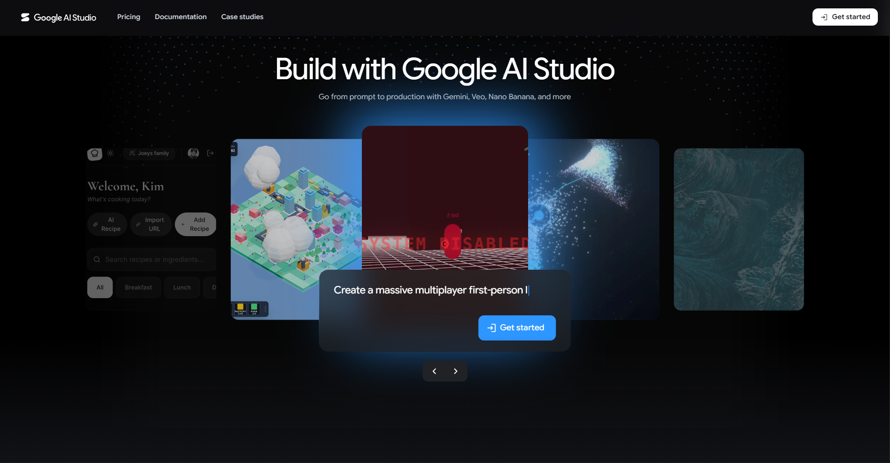
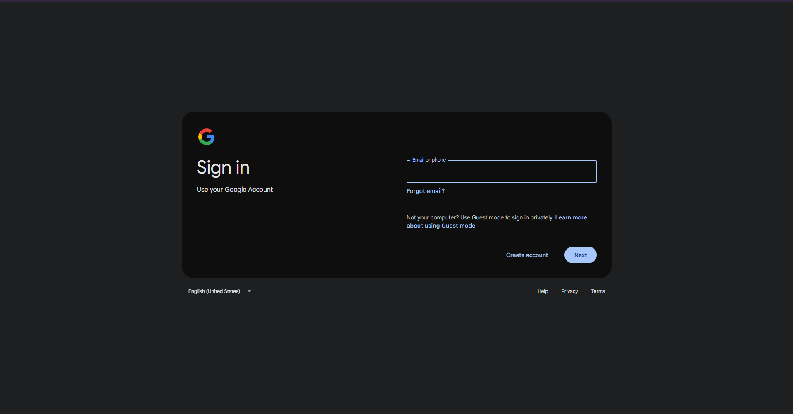
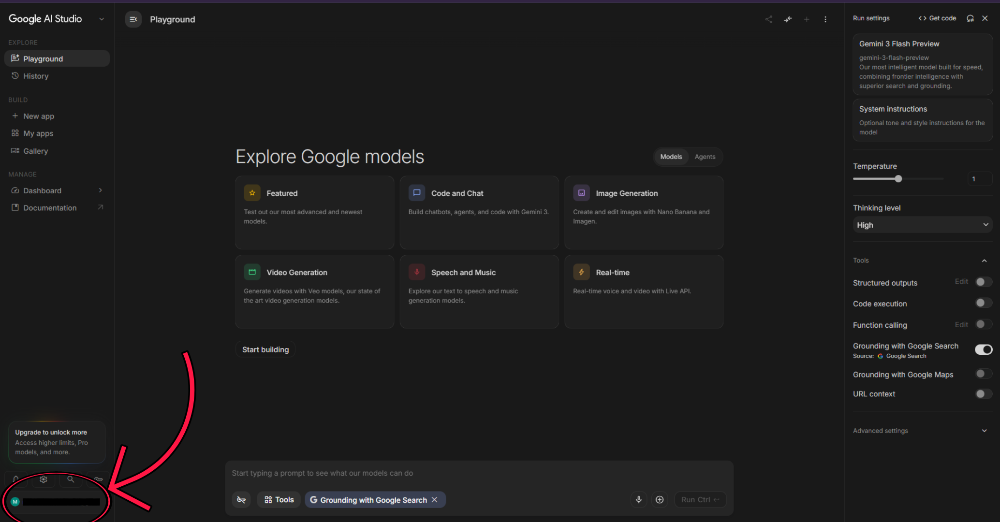
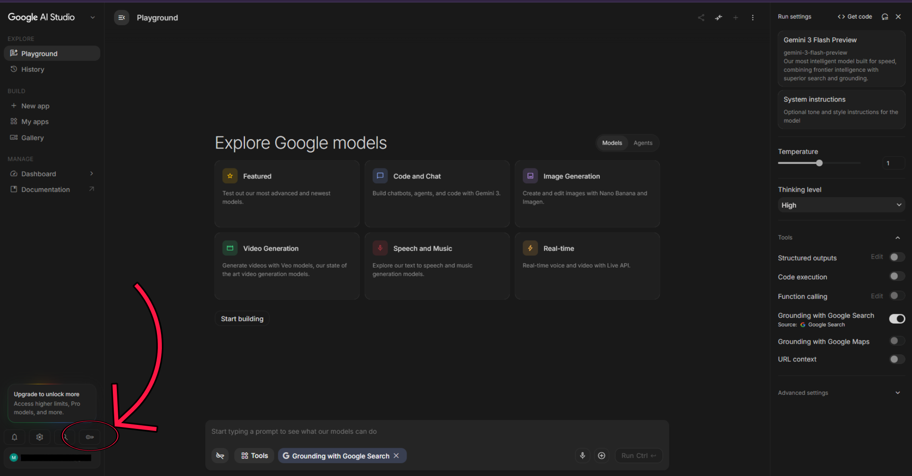
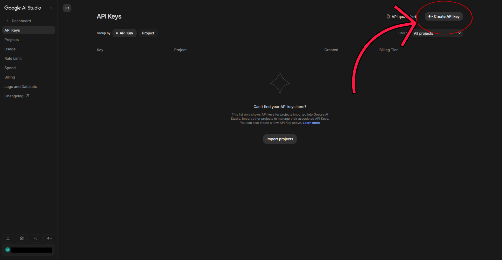
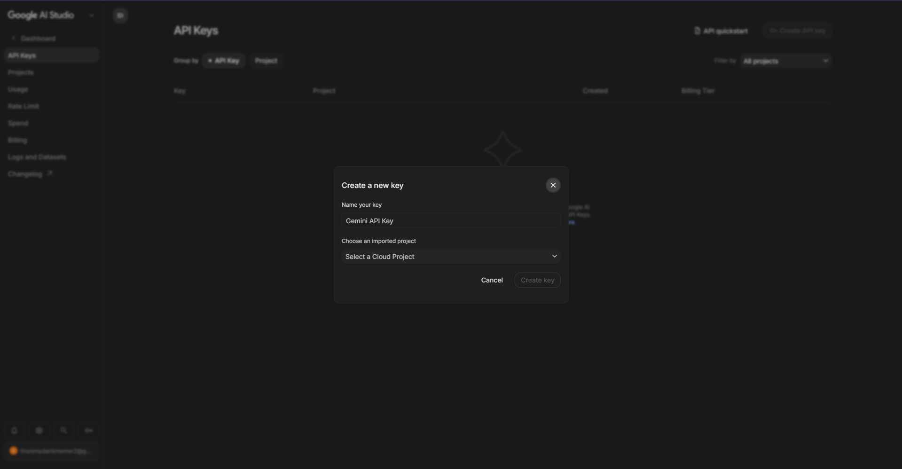
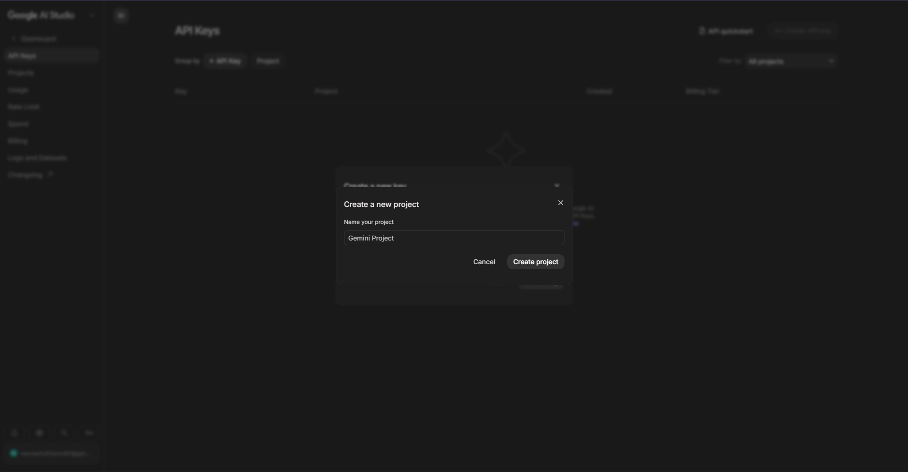
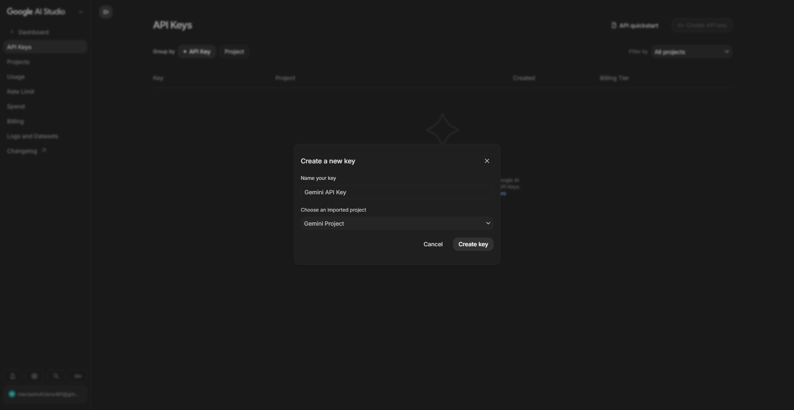
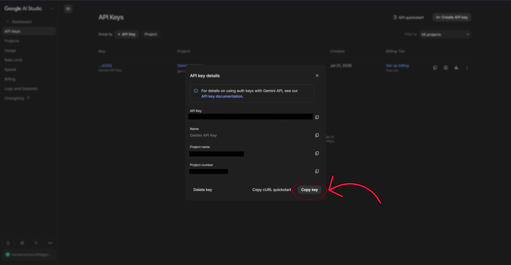

# 🚀 Gemini API Setup

This guide will help you configure **Google Gemini** for this project.

Gemini serves as the **fallback AI inference provider**. If Groq is unavailable, encounters an error, or cannot process a request, the application will automatically use Gemini to continue AI inference.

By the end of this guide, you will have:

- ✅ Created (or signed in to) a Google AI Studio account
- ✅ Generated a Gemini API key
- ✅ Configured the project's environment variables
- ✅ Enabled Gemini as the fallback AI provider

---

## 📋 Table of Contents

1. [Open Google AI Studio](#step-1-open-google-ai-studio)
2. [Sign In](#step-2-sign-in)
3. [Open the API Keys Page](#step-3-open-the-api-keys-page)
4. [Create an API Key](#step-4-create-an-api-key)
5. [Configure the API Key](#step-5-configure-the-api-key)
6. [Create a Google Cloud Project (If Needed)](#step-6-create-a-google-cloud-project-if-needed)
7. [Generate the API Key](#step-7-generate-the-api-key)
8. [Copy the API Key](#step-8-copy-the-api-key)
9. [Configure the Project](#-configure-the-project)
10. [Setup Complete](#-setup-complete)

---

## Step 1: Open Google AI Studio

👉 [Google AI Studio](https://aistudio.google.com/welcome)

Click **Get Started**.



---

## Step 2: Sign In

After clicking **Get Started**, one of two things will happen:

- If you are **not signed in**, you'll be prompted to sign in with your Google account.
- If you are **already signed in**, you'll be taken directly to the Google AI Studio playground.

If you wish to use a different Google account, click your email in the bottom-left corner, sign out, and then sign back in with your preferred account.

| Sign In | Already Signed In |
|----------|-------------------|
|  |  |

---

## Step 3: Open the API Keys Page

Once you're inside Google AI Studio, click the **key icon** located on the bottom-left sidebar.

This opens the **Get an API Key** page.



---

## Step 4: Create an API Key

On the API Keys page, click **Create API Key**.



---

## Step 5: Configure the API Key

A dialog titled **Create a new key** will appear.

It contains the following options.

### 🏷️ Name your key

Give your API key any name you prefer.

Examples include:

- VoucherBot
- Development
- Production
- Personal Laptop

### 📁 Choose an imported project

If you already have a Google Cloud project, simply select it from the dropdown.

If you don't have one yet, choose **Create Project** from the dropdown instead.



---

## Step 6: Create a Google Cloud Project (If Needed)

If you selected **Create Project**, another dialog titled **Create a new project** will appear.

Enter any project name you like.

Then click **Create Project**.

Google AI Studio will automatically create the project for you and select it in the **Choose an imported project** dropdown.



---

## Step 7: Generate the API Key

Once your project has been selected, click **Create Key**.

Google AI Studio will generate your Gemini API key.



---

## Step 8: Copy the API Key

A dialog titled **API Key Details** will appear.

It contains information such as:

- API Key
- Key Name
- Project Name
- Project Number

Copy the API key, or simply click **Copy Key**.



---

# ⚙️ Configure the Project

Open your project's `.env` file and locate the following variable:

```env
GEMINI_API_KEY="your_gemini_api_key"
```

Replace:

```env
your_gemini_api_key
```

with the API key you copied from Google AI Studio.

Example:

```env
GEMINI_API_KEY="AIzaSyXXXXXXXXXXXXXXXXXXXXXXXXXXXX"
```

Save the file.

---

# 🎉 Setup Complete

Your project is now configured to use Gemini as its fallback AI provider.

If Groq is unavailable or cannot complete an inference request, the application can automatically use Gemini instead.

If you wish, you can also configure additional Google AI Studio features, such as:

- Billing
- Usage limits
- Additional API keys
- Project management
- Model configuration
- Safety settings

These are optional and are not required for this project.