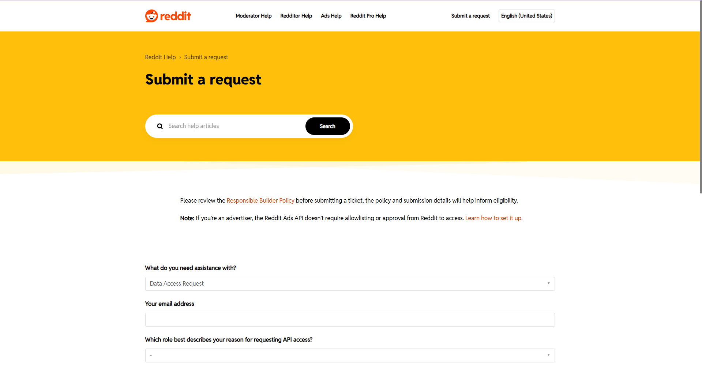
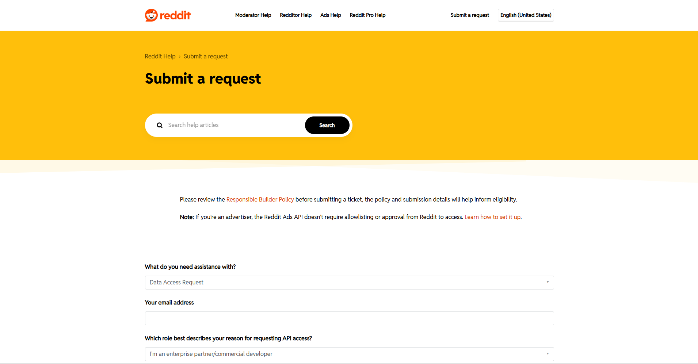

# Reddit API Access & OAuth Credentials

## ⚠️ Important: Reddit API Access is Now Approval-Based

As of recent policy changes, Reddit no longer allows open API access. **All API requests must now be submitted for review and approved by Reddit before you can obtain credentials.** This process takes time — potentially days or even weeks — and **your request may be rejected** with no guarantee of approval. Plan accordingly before building anything that depends on the Reddit API.

---

## Requesting API Access

Depending on your use case, submit a request through the appropriate form below:

### Personal Use
If you're building something for personal/non-commercial use, submit your request here:

👉 [Reddit API Request — Personal](https://support.reddithelp.com/hc/en-us/requests/new?ticket_form_id=14868593862164)



### Commercial Use
If you're building a commercial product or enterprise application, use this form instead:

👉 [Reddit API Request — Commercial/Enterprise](https://support.reddithelp.com/hc/en-us/requests/new?ticket_form_id=14868593862164&tf_42139884615700=api_request_type_enterprise_clone)



---

## After Approval

Once Reddit approves your request, you should receive a **Client ID** and **Client Secret**. Add these to your `.env` file as follows:

```dotenv
REDDIT_CLIENT_ID=your_client_id
REDDIT_CLIENT_SECRET=your_client_secret
```

---

## ⚠️ A Note from the Author

At the time of writing, I have not yet received my own API credentials from Reddit, so unfortunately I'm unable to provide further step-by-step instructions beyond this point. Here's hoping your request gets approved — good luck! 🤞