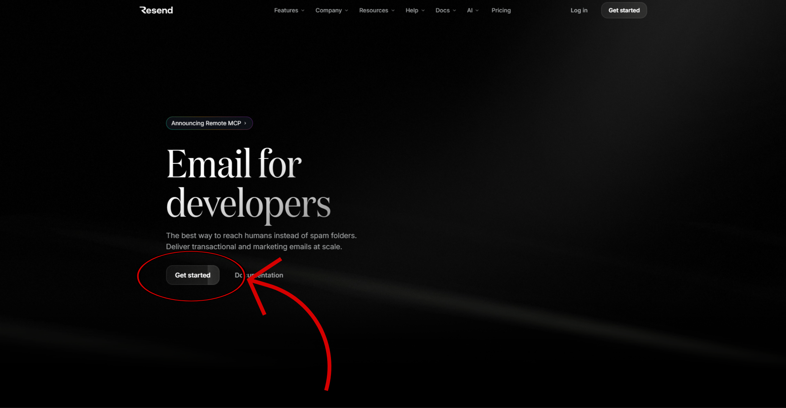
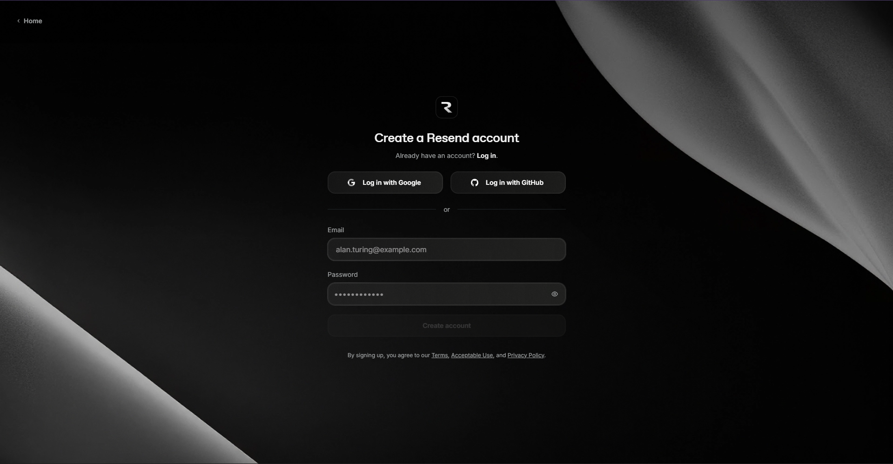
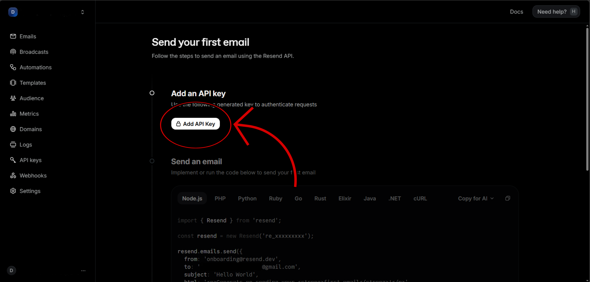
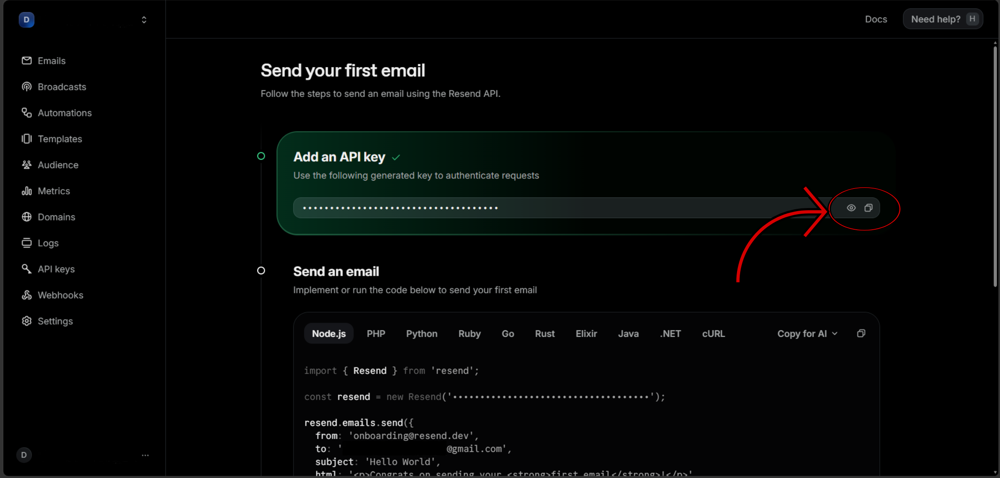

# 🚀 Resend Email Automation Setup

This guide will help you configure **Resend** so the project can send email notifications.

By the end of this guide, you will have:

- ✅ Created (or signed in to) a Resend account
- ✅ Generated a Resend API key
- ✅ Configured the required environment variables
- ✅ Enabled email automation for the project

---

## 📋 Table of Contents

1. [Create a Resend Account](#step-1-create-a-resend-account)
2. [Sign Up or Sign In](#step-2-sign-up-or-sign-in)
3. [Generate an API Key](#step-3-generate-an-api-key)
4. [Copy Your API Key](#step-4-copy-your-api-key)
5. [Configure the Project](#-configure-the-project)
6. [Example Configuration](#example-configuration)
7. [Setup Complete](#-setup-complete)

---

## Step 1: Create a Resend Account

👉 [Go to Resend](https://www.resend.com/)

Click **Get started**.



---

## Step 2: Sign Up or Sign In

After clicking **Get started**, you'll be redirected to the Resend authentication page.

👉 [Resend Sign Up](https://www.resend.com/signup)

From here, either:

- Sign up for a new account.
- Sign in if you already have one.

Choose whichever option applies to you.



---

## Step 3: Generate an API Key

After signing in, you'll be taken to the onboarding page.

Click the **Add API Key** button.



---

## Step 4: Copy Your API Key

Resend will generate an API key for you.

Copy the API key and keep it somewhere safe.

You will use this key when configuring your project's environment variables.



---

# ⚙️ Configure the Project

Open your project's `.env` file and locate the following section:

```env
# Email Automation
# See docs/setup.md for how to get your Resend API key and configure your email.
RESEND_API_KEY="your_resend_api_key"
EMAIL_ID="your_email_id"
EMAIL_MIN_INTERVAL_SECONDS="5.0"  # Rate limiting between emails
```

Configure the variables as follows:

### 🔑 RESEND_API_KEY

Replace:

```env
your_resend_api_key
```

with the API key you copied from the Resend dashboard.

---

### 📧 EMAIL_ID

> **❗ IMPORTANT**
>
> **Use the same email address that you used to sign up for your Resend account.**

For example:

```env
EMAIL_ID="you@example.com"
```

The free Resend plan only allows sending emails from your verified account email.

If you wish to send emails from a different address or your own domain, you will need to upgrade to a paid plan and configure domain verification within Resend.

---

### ⏱️ EMAIL_MIN_INTERVAL_SECONDS

Leave this value unchanged:

```env
EMAIL_MIN_INTERVAL_SECONDS="5.0"
```

This setting controls the minimum delay between outgoing emails and is suitable for this project.

---

## Example Configuration

```env
# Email Automation
# See docs/setup.md for how to get your Resend API key and configure your email.
RESEND_API_KEY="re_xxxxxxxxxxxxxxxxxxxxxxxxx"
EMAIL_ID="your-email@example.com"
EMAIL_MIN_INTERVAL_SECONDS="5.0"
```

---

# 🎉 Setup Complete

Your project is now configured to send emails using Resend.

If you wish, you can further configure additional Resend features, including:

- Custom sending domains
- Domain verification
- Webhooks
- Email analytics
- Audience management
- Templates

These features are optional and are not required for this project.