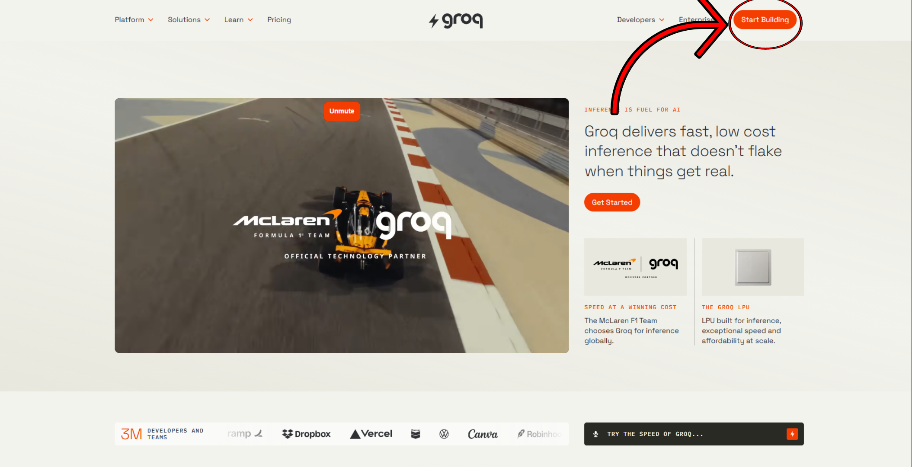
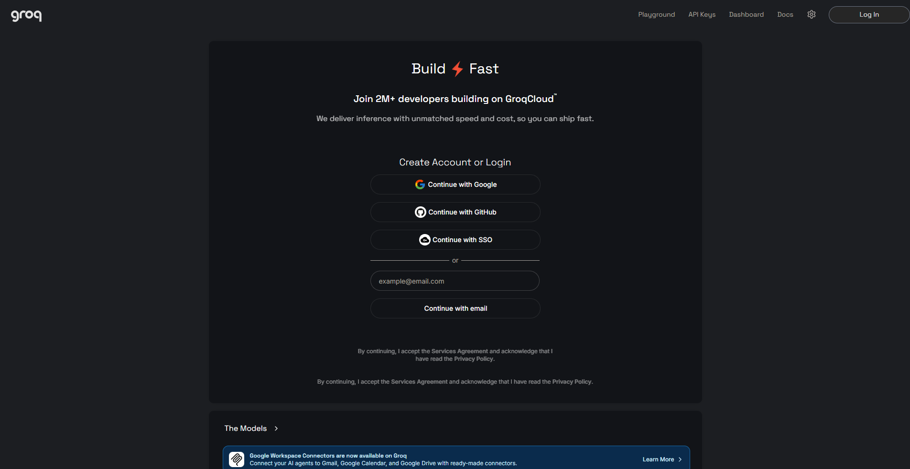
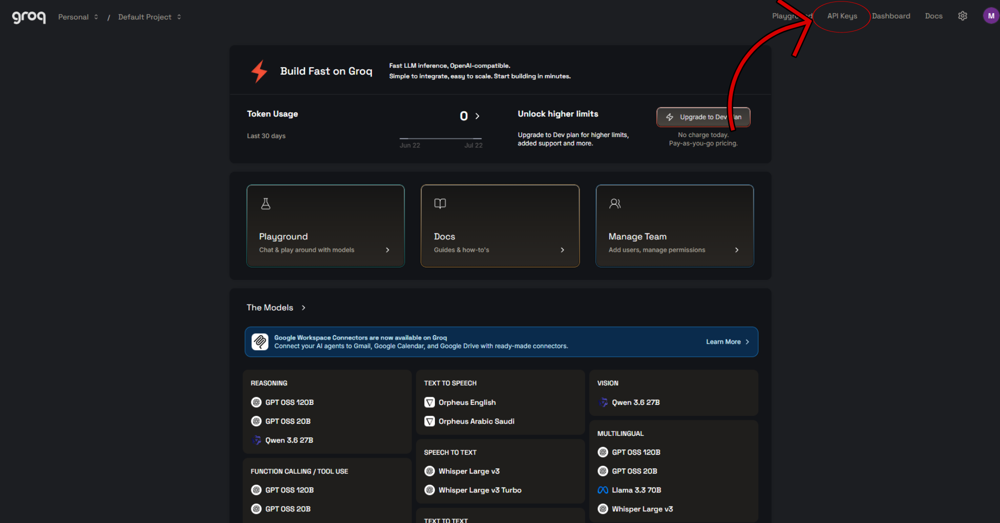
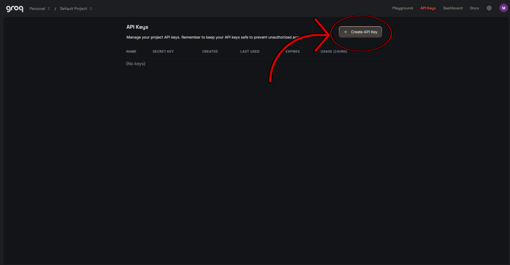
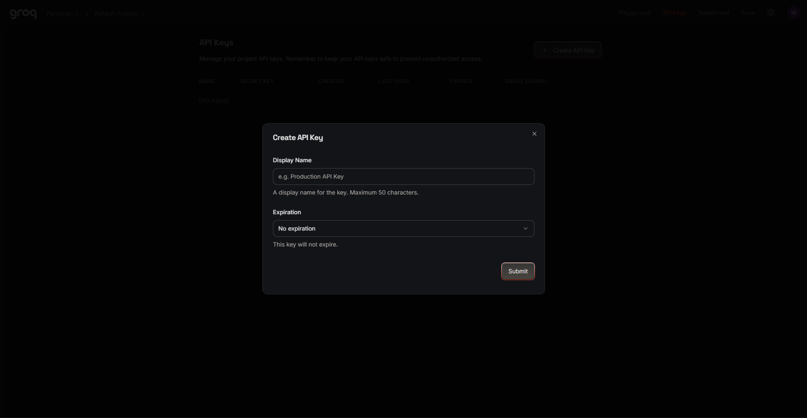
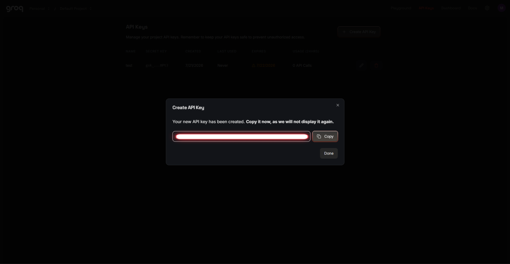
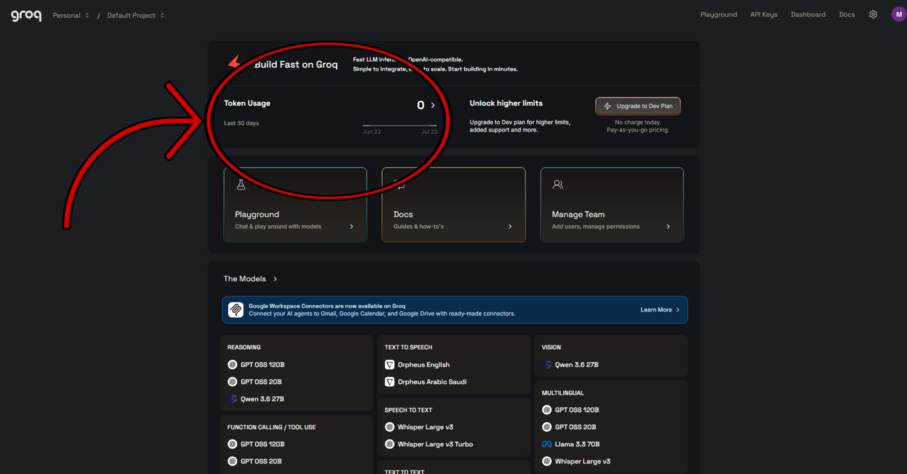

# 🚀 Groq AI Inference Setup

This guide will help you configure **Groq** for this project.

Groq is used by the project's **AI inference module** to analyze discovered posts and determine whether they contain legitimate certification vouchers, discounts, promotions, or other relevant opportunities.

By the end of this guide, you will have:

- ✅ Created (or signed in to) a Groq account
- ✅ Generated an API key
- ✅ Configured the project's environment variables
- ✅ Enabled AI-powered voucher classification

---

## 📋 Table of Contents

1. [Create a Groq Account](#step-1-create-a-groq-account)
2. [Sign Up or Sign In](#step-2-sign-up-or-sign-in)
3. [Open the API Keys Page](#step-3-open-the-api-keys-page)
4. [Create an API Key](#step-4-create-an-api-key)
5. [Copy Your API Key](#step-5-copy-your-api-key)
6. [Configure the Project](#-configure-the-project)
7. [Other Configuration Options](#other-configuration-options)
8. [Viewing API Usage](#viewing-api-usage)
9. [Setup Complete](#-setup-complete)

---

## Step 1: Create a Groq Account

👉 [Go to Groq](https://groq.com/)

In the top-right corner, click **Start Building**.



---

## Step 2: Sign Up or Sign In

After clicking **Start Building**, you'll be redirected to the Groq Developer Console.

👉 [Groq Developer Console](https://console.groq.com/home)

From here, either:

- Sign up for a new account.
- Sign in if you already have one.

Choose whichever option applies to you.



---

## Step 3: Open the API Keys Page

After signing in, you'll be taken to the Groq dashboard.

In the top-right corner, click **API Keys**.

This is where you'll create the API key required by this project.



---

## Step 4: Create an API Key

On the API Keys page, click **Create API Key**.



A dialog will appear asking for the following:

### 🏷️ Display Name

Choose any name you like for your API key.

For example:

- VoucherBot
- Production
- Development
- Personal Laptop

### ⏳ Expiration

By default, the key has **No Expiration**.

You can leave this unchanged.

If you prefer rotating API keys regularly or only need the key temporarily, you may choose an expiration date instead.



---

## Step 5: Copy Your API Key

After creating the key, Groq will display the API key.

> **❗ IMPORTANT**
>
> **This is the only time Groq will display your API key. Once you close this window, you cannot view the key again. Make sure to copy it now and store it somewhere safe before clicking _Done_.**



---

# ⚙️ Configure the Project

Open your project's `.env` file and locate the following section:

```env
GROQ_API_KEY="your_groq_api_key"

GROQ_REQUESTS_PER_MINUTE="30"
GROQ_MAX_COMPLETION_TOKENS="1024"
GROQ_MAX_INPUT_CHARS="12000"
```

Replace:

```env
your_groq_api_key
```

with the API key you copied from the Groq dashboard.

---

## Other Configuration Options

Leave the remaining variables unchanged:

```env
GROQ_REQUESTS_PER_MINUTE="30"
GROQ_MAX_COMPLETION_TOKENS="1024"
GROQ_MAX_INPUT_CHARS="12000"
```

These values have been selected for this project and generally do not need to be modified.

> ⚠️ Only change them if you understand how they affect the application's AI inference behavior and wish to customize the project.

---

## Viewing API Usage

You can monitor how much of your Groq quota the application is using.

From the Groq dashboard, click **Token Usage**.

There you can view information such as:

- 📊 Token consumption
- 🕒 Request history
- 📈 Usage over time
- 🔋 Remaining quota (depending on your account)



---

# 🎉 Setup Complete

Your project is now configured to use Groq for AI inference.

The AI module can now analyze discovered content and determine whether it contains relevant certification vouchers or promotional opportunities.

If you wish, you can further configure Groq by selecting different AI models, adjusting inference settings, managing API keys, or configuring other developer options available within the Groq dashboard.