# 🚀 Render Deployment Setup

This guide will help you deploy the project on **Render** so your app can run in the cloud and send email notifications.

By the end of this guide, you will have:

- ✅ Created (or signed in to) a Render account
- ✅ Connected your repository to Render
- ✅ Configured your web service with the correct settings
- ✅ Added all required environment variables
- ✅ Deployed your app successfully

---

## 📋 Table of Contents

1. [Create a Render Account](#step-1-create-a-render-account)
2. [Sign Up or Sign In](#step-2-sign-up-or-sign-in)
3. [Select a Service Type](#step-3-select-a-service-type)
4. [Connect Your Repository](#step-4-connect-your-repository)
5. [Authenticate with GitHub](#step-5-authenticate-with-github)
6. [Select Your Repository](#step-6-select-your-repository)
7. [Configure the Web Service](#step-7-configure-the-web-service)
8. [Choose an Instance Type](#step-8-choose-an-instance-type)
9. [Configure Environment Variables](#step-9-configure-environment-variables)
10. [Deploy Your Web Service](#step-10-deploy-your-web-service)
11. [Monitor Your Deployment](#step-11-monitor-your-deployment)
12. [Copy Your App URL](#step-12-copy-your-app-url)
- [🔁 Alternate: Blueprint Deployment](#-alternate-blueprint-deployment)

---

## Step 1: Create a Render Account

👉 [Go to Render](https://render.com/)

Click **Start for Free**.

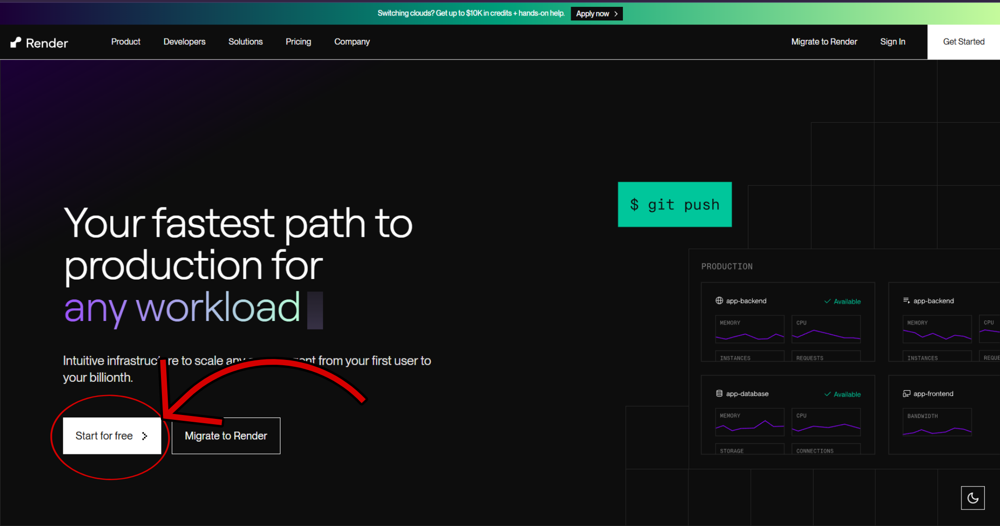

---

## Step 2: Sign Up or Sign In

After clicking **Start for Free**, you'll be redirected to the Render registration page.

👉 [Render Register](https://dashboard.render.com/register)

From here, either:

- Sign up for a new account using the method of your choice.
- Sign in if you already have one.

Choose whichever option applies to you.

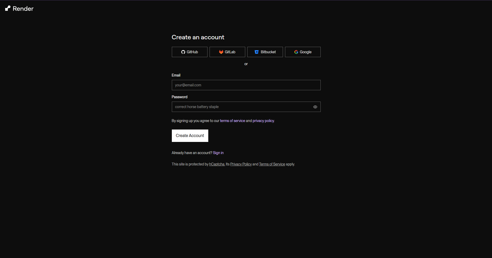

---

## Step 3: Select a Service Type

After logging in, you'll be taken to the Render dashboard where you can select the type of service you want to deploy.

For this project, we will be using **Web Service**.

Click on **Web Service** to proceed.

> 💡 **Alternatively**, you can deploy using the Blueprint method. See the [Blueprint Deployment](#-alternate-blueprint-deployment) section at the bottom of this guide.

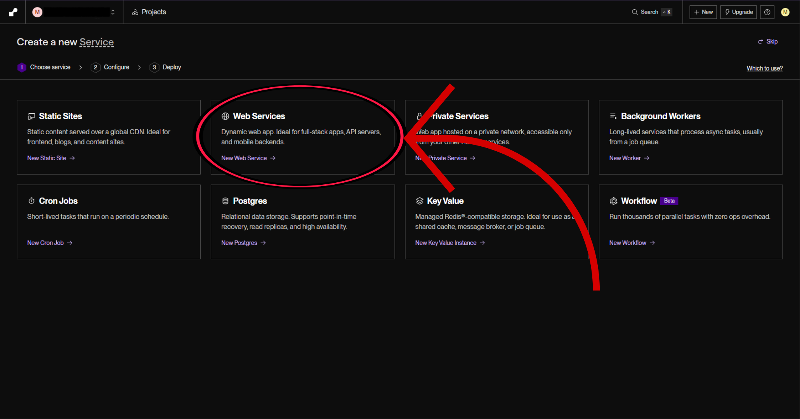

---

## Step 4: Connect Your Repository

You'll now be taken to a page where you can configure how Render connects to your source code.

If you forked the repository and want to connect your own fork, click **GitHub** from the available options.

> You can also use GitLab, Bitbucket, or any other supported provider.

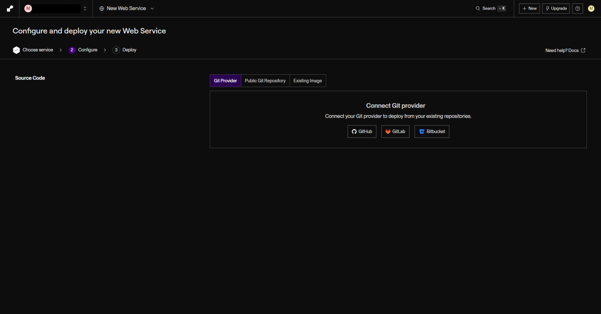

---

## Step 5: Authenticate with GitHub

After clicking **GitHub**, a GitHub authentication prompt will appear.

Allow Render to connect to your GitHub account. You can choose to grant access to:

- **All repositories**, or
- **Only the forked repository** of the bot (recommended for security)

Choose whichever option you prefer.

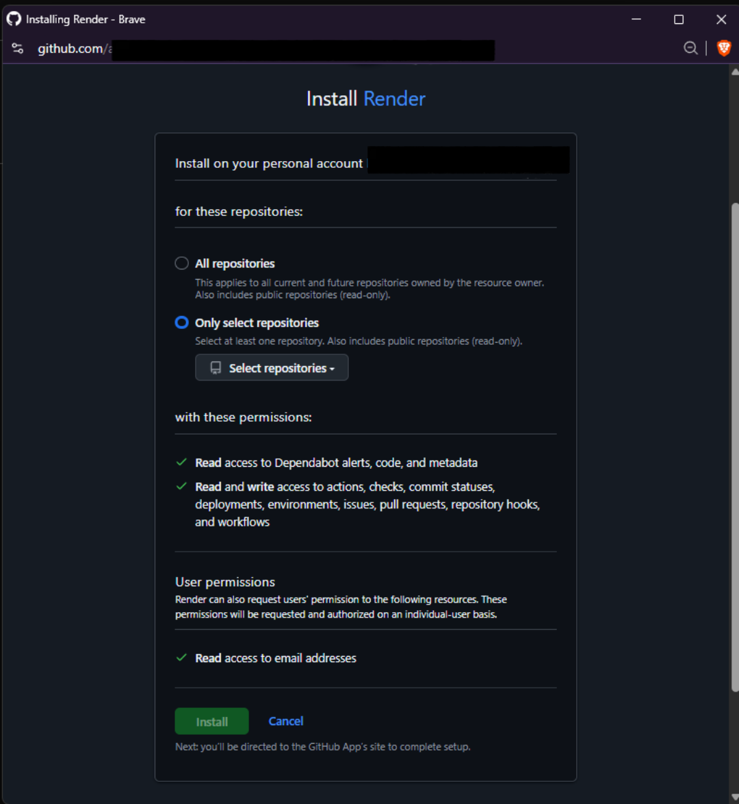

---

## Step 6: Select Your Repository

Once authenticated, your connected repositories will be listed on the page.

Click on your forked repository to proceed with configuration.

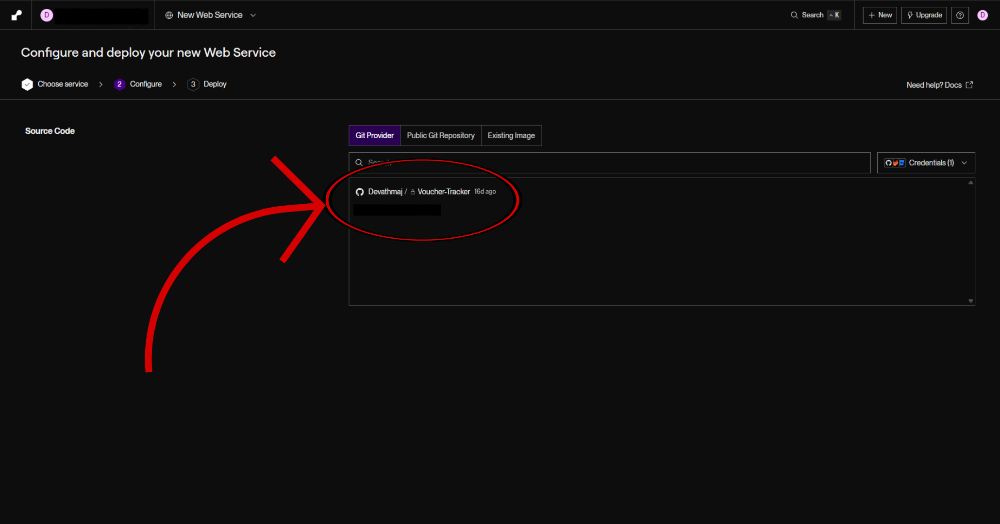

> **Alternatively — Connect via Public Git Repository**
>
> If you haven't forked the repo, you can connect directly to the original repository using the **Public Git Repository** option (next to the Git provider options).
>
> 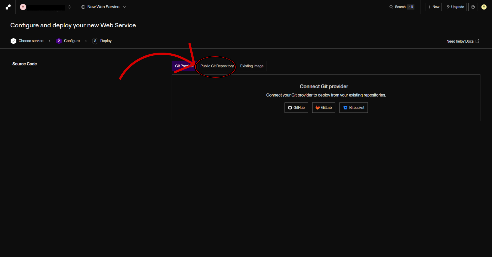
>
> After clicking it, type the link to the original repository in the box and Render will fetch the code from there.
>
> 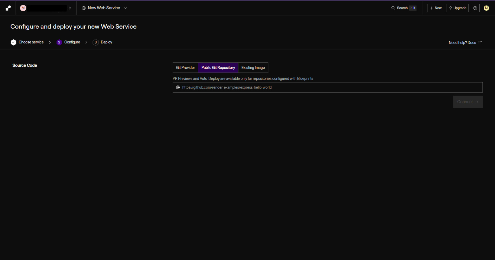
>
> ⚠️ **Keep in mind:** This method pulls directly from the original repository, meaning any changes made to it will affect your deployment. Only choose this option if you're comfortable with that.

---

## Step 7: Configure the Web Service

You'll now be taken to the **Configure and Deploy Your Web Service** page. Fill in the settings as follows:

- **Source Code** — Should automatically reflect the repository you just connected. Verify this is correct.
- **Name** — You can give your service any name you like.
- **Language** — Select **Docker**.
  > ⚠️ While Python 3 is available as an option, it appears to have issues. A `Dockerfile` is already included in the project, so **Docker is the recommended choice**.
- **Branch** — Select `main`, or whichever branch you prefer (default is `main`).
- **Region** — You can leave this as the default (Oregon, US West) or choose a region geographically closer to you.
- **Root Directory** — Leave this field **blank**.

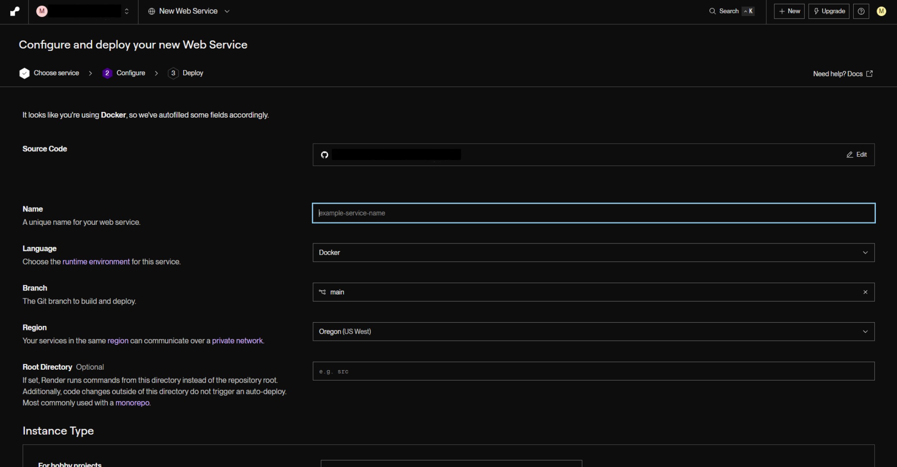

---

## Step 8: Choose an Instance Type

Scroll down to the **Instance Type** section.

Unless you are already on a paid Render plan and are willing to spend, select the **Free** tier — it is sufficient for this project.

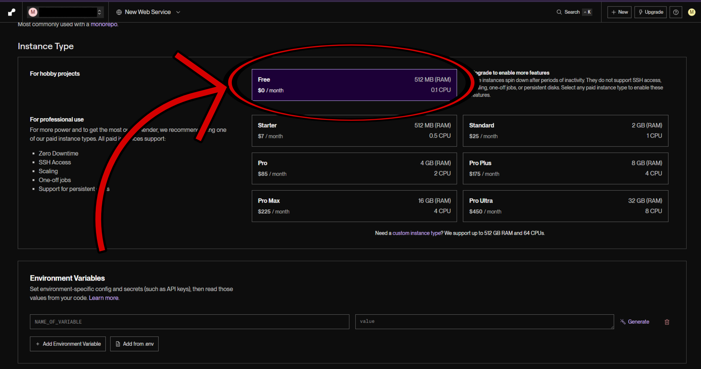

---

## Step 9: Configure Environment Variables

Next, you'll need to add your environment variables.

Assuming you've already followed the setup guides and have your environment variables ready (either saved in a `.env` file or noted down), you can add them in one of two ways:

- **Manually** — Type the name and value of each variable one by one.
- **From a file** — Click **Add from .env** and select your `.env` file from your device.

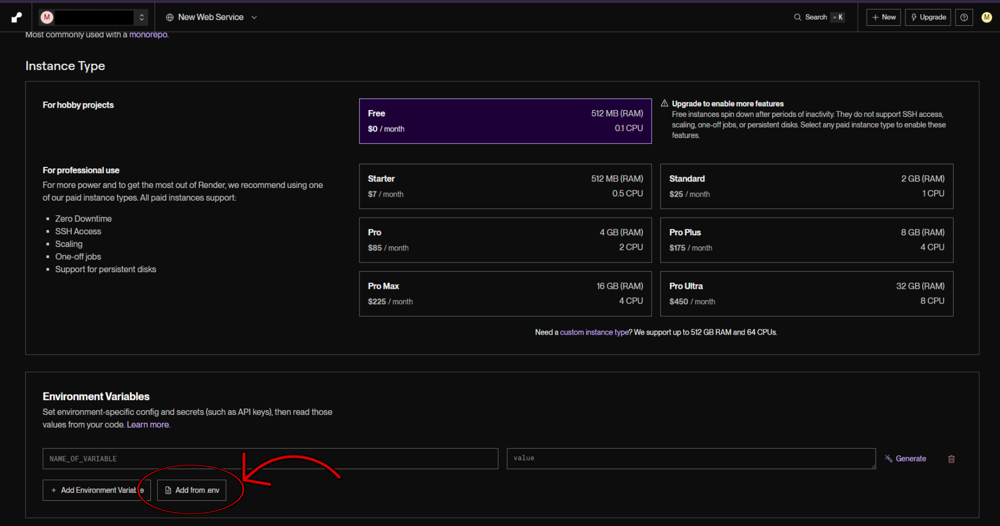

> ⚠️ **Important:** Before deploying, make sure to **delete the blank environment variable** that Render creates by default. Leaving it in may cause issues.

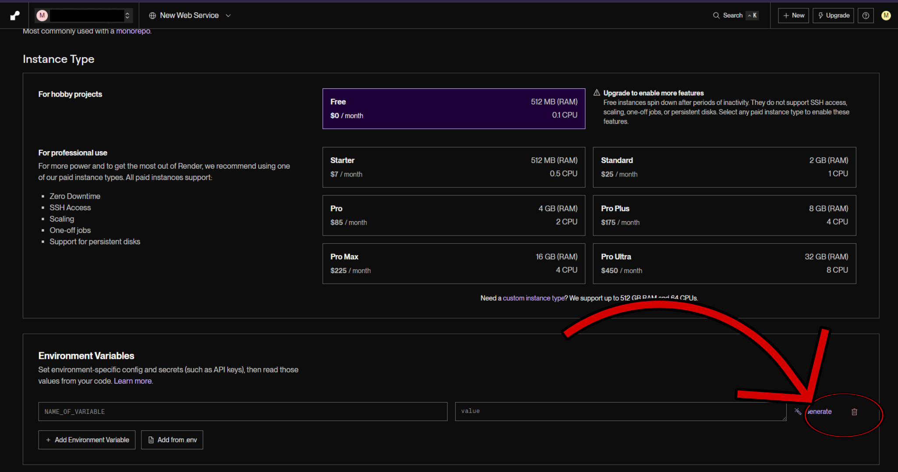

---

## Step 10: Deploy Your Web Service

Once everything is configured and your environment variables are set, click **Deploy Web Service**.

This will take you to your deployment dashboard.

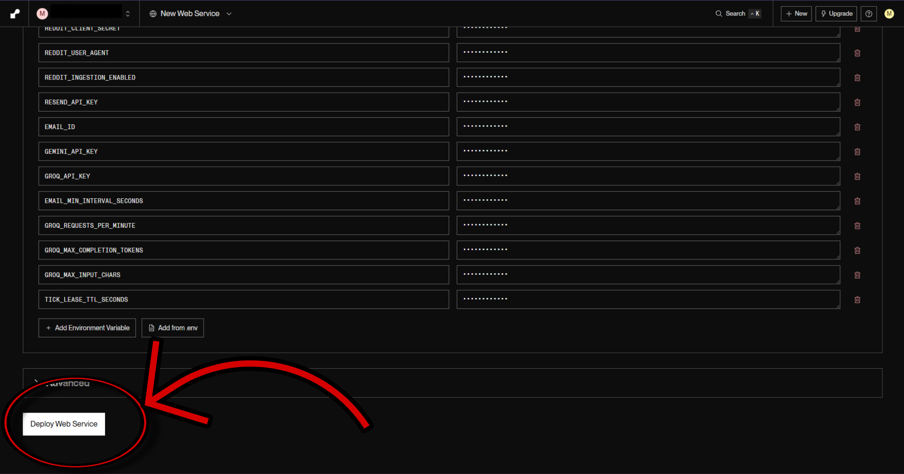

---

## Step 11: Monitor Your Deployment

On the deployment dashboard, wait for your app to finish deploying.

- You can monitor progress through the **live logs**.
- Once deployment is complete, the status will change to **Live**.

🎉 Your app is now running! It will send you an email (a congratulatory voucher message) to confirm it's working correctly.

---

## Step 12: Copy Your App URL

After your app is live, Render will provide a public URL for your deployment.

**Copy this URL** and keep it somewhere safe — you'll need it to set up an uptime monitor to keep your app running continuously.

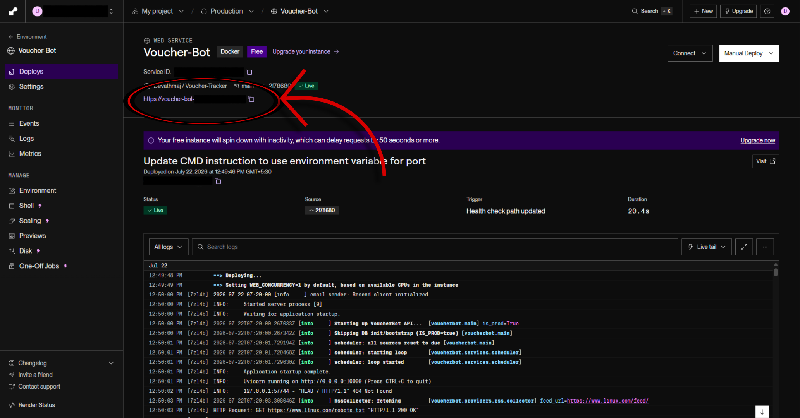

> 🔗 **Next Step:** Set up an uptime bot to keep your app alive.
> Follow the guide at [docs/setup/uptime-bot-setup.md](../uptime-bot-setup.md)

---

---

# 🔁 Alternate: Blueprint Deployment

> ⚠️ **Important:** The Blueprint deployment method **requires a payment method to be set up on your Render account**, even if you intend to stay on the free tier. Make sure you are comfortable with this before proceeding.

Instead of creating a Web Service manually, you can deploy using Render's Blueprint feature, which reads the project's `render.yaml` configuration file automatically.

### Step 1: Click + New

After logging in, instead of clicking **Web Service**, click the **+ New** button in the top right corner of the dashboard.

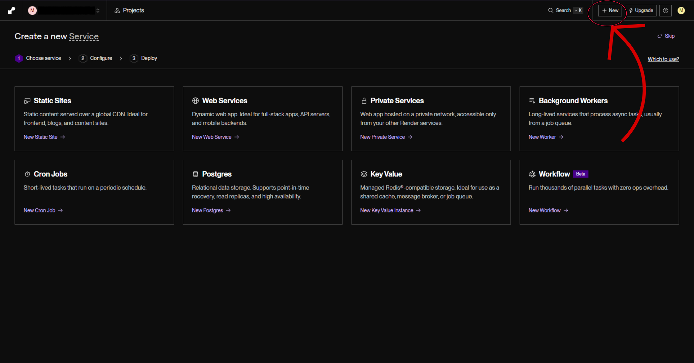

---

### Step 2: Select Blueprint

From the dropdown menu that appears, click **Blueprint**.

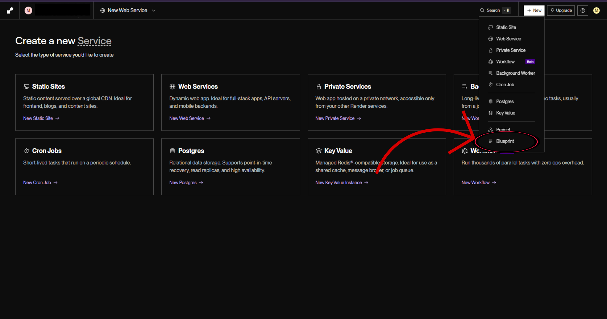

---

### Step 3: Connect Your Repository

You'll be taken to the Blueprint setup page. Connect your repository here — the process is the same as connecting via GitHub described earlier in this guide.

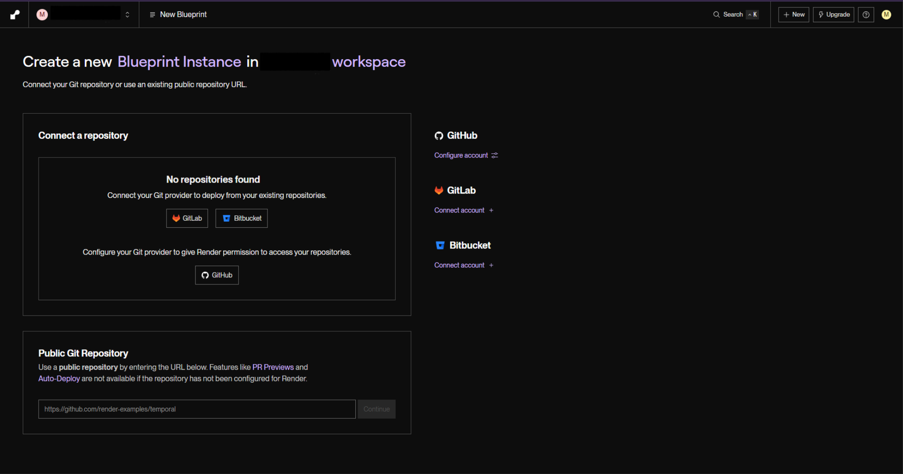

---

### Step 4: Select Your Project

After connecting, a dropdown will appear listing your connected repositories. Select the repository you want to configure via Blueprint (`render.yaml`).

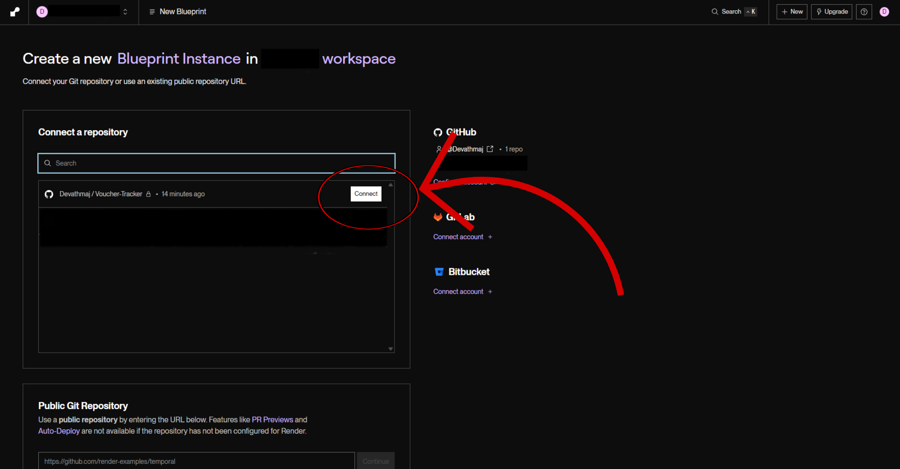

---

> ⚠️ **Note:** Unfortunately, further instructions for the Blueprint method cannot be provided at this time, as this guide was written without a payment method configured on Render. The remaining steps will need to be completed by you. Render's own documentation should be able to guide you through the rest of the Blueprint setup process.