# 🤖 Uptime Bot Setup

This guide will help you configure **UptimeRobot** to keep your deployed app alive by pinging it at regular intervals.

By the end of this guide, you will have:

- ✅ Created (or signed in to) an UptimeRobot account
- ✅ Created a monitor for your Render app
- ✅ Disabled email notifications to avoid alert spam
- ✅ Configured a suitable polling interval
- ✅ Your app staying alive automatically

---

## 📋 Table of Contents

1. [Create an UptimeRobot Account](#step-1-create-an-uptimerobot-account)
2. [Sign Up or Sign In](#step-2-sign-up-or-sign-in)
3. [Create Your First Monitor](#step-3-create-your-first-monitor)
4. [Set Up Test Notifications](#step-4-set-up-test-notifications)
5. [Create a Public Status Page](#step-5-create-a-public-status-page)
6. [Go to Your Dashboard](#step-6-go-to-your-dashboard)
7. [Click on Your Monitor](#step-7-click-on-your-monitor)
8. [Open Monitor Info & Edit](#step-8-open-monitor-info--edit)
9. [Disable Email Notifications](#step-9-disable-email-notifications)
10. [Adjust Polling Interval](#step-10-adjust-polling-interval)
11. [Save Your Changes](#step-11-save-your-changes)
- [🔀 Alternate Flow](#-alternate-flow)

---

## Step 1: Create an UptimeRobot Account

👉 [Go to UptimeRobot](https://uptimerobot.com/)

Click **Start Monitoring in 30 Seconds**.

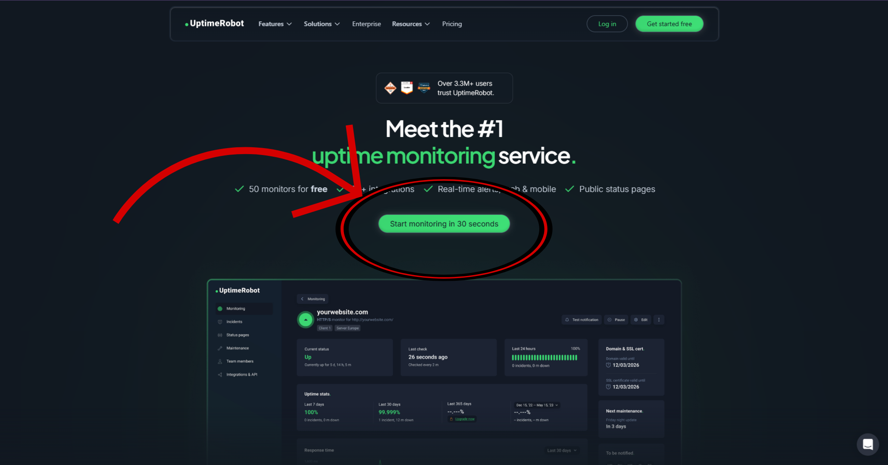

---

## Step 2: Sign Up or Sign In

After clicking the button, you'll be redirected to the UptimeRobot registration page.

👉 [UptimeRobot Sign Up](https://dashboard.uptimerobot.com/sign-up/)

From here, either:

- Sign up for a new account.
- Sign in if you already have one.

Choose whichever option applies to you.

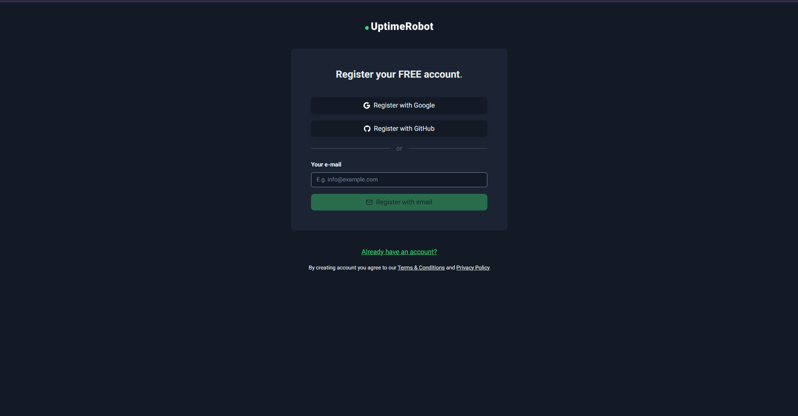

> 💡 **Don't see this page?** If instead you see a page with a **Website to Monitor** field and a **Create your account** section, you've entered a different flow. Head to the [🔀 Alternate Flow](#-alternate-flow) section at the bottom of this guide and follow those steps instead.

---

## Step 3: Create Your First Monitor

Once you're signed in, UptimeRobot will start the onboarding process with **Create Your First Monitor**.

- **Monitor Type** — Select **HTTP(s) / Website Monitoring** (this is the default).
- **URL to Monitor** — Enter the URL of your deployed Render app.

> 🔗 **Where do I find my app's URL?**
> Your Render app URL was provided after deployment. If you haven't saved it, refer back to **Step 12** of the [Render Deployment Guide](render-setup.md), where you copied and saved your app URL from the Render dashboard.

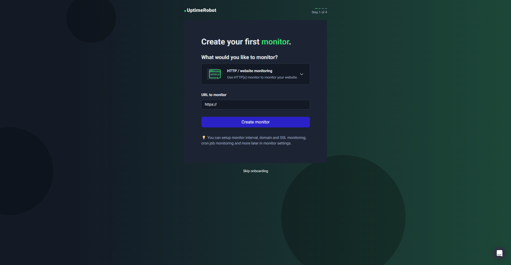

---

## Step 4: Set Up Test Notifications

The next step in onboarding is **Test Notification**, which sends you an alert email whenever your site goes down.

You can **skip this step** — we will configure notifications properly in a later step.

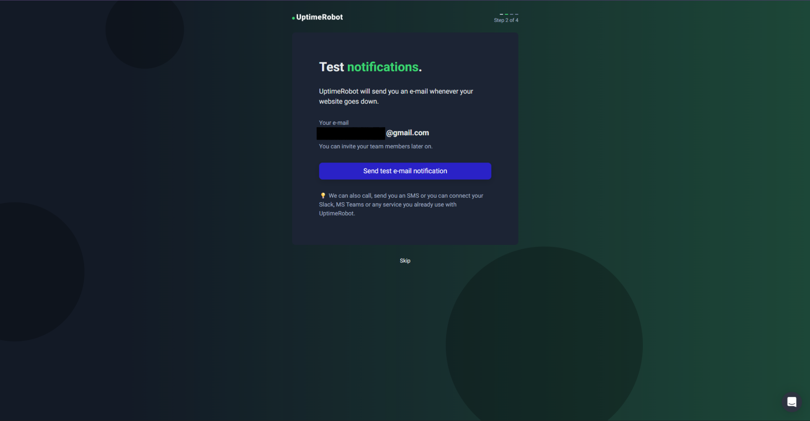

---

## Step 5: Create a Public Status Page

The next onboarding step is **Create a Public Status Page**.

This is enabled by default. You can:

- Leave it **on** (default), or
- Turn it **off** — entirely up to you.

Either way, feel free to skip or finish this step as it doesn't affect the core functionality of your uptime monitor.

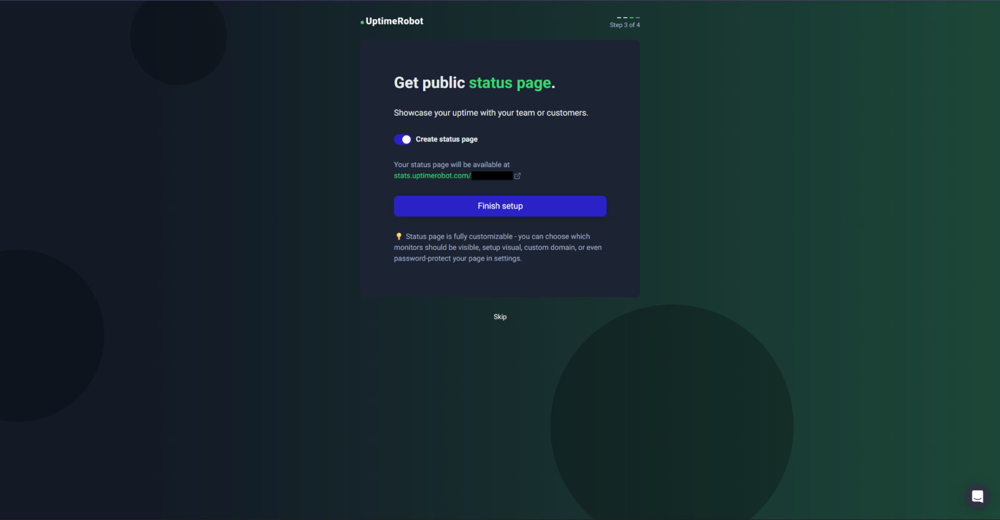

---

## Step 6: Go to Your Dashboard

After completing or skipping the onboarding steps, you'll be shown a screen confirming your monitor is ready, with two options:

- **See all features**
- **Nah, get me to the dashboard already**

Click **Nah, get me to the dashboard already** to proceed to your monitor dashboard.

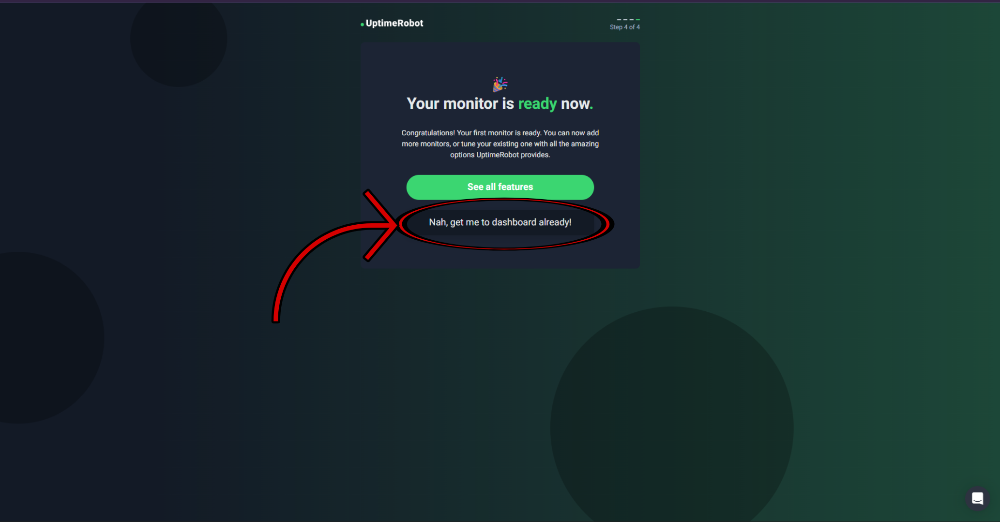

---

## Step 7: Click on Your Monitor

From the dashboard, click on your monitor to open it.

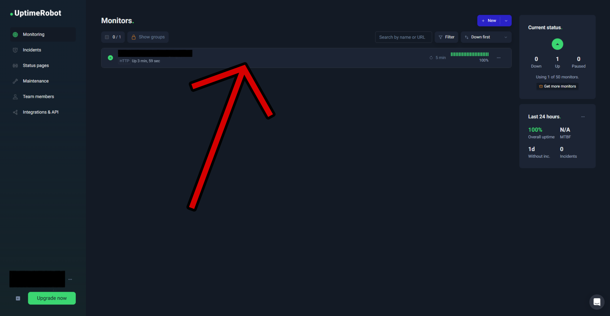

---

## Step 8: Open Monitor Info & Edit

You'll now see the monitor info page. From here, locate and click the **Edit** button to open the edit panel.

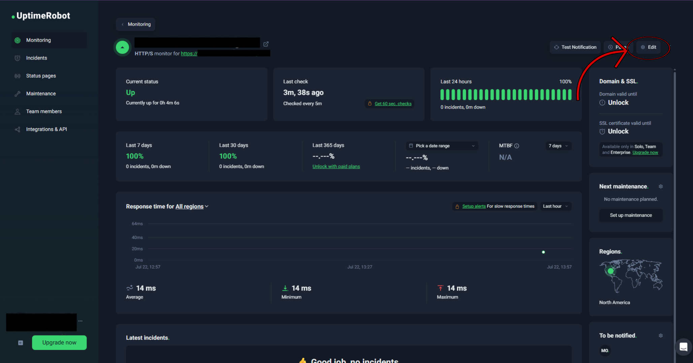

---

## Step 9: Disable Email Notifications

> ⚠️ **Important — Please Read**
>
> The Render free tier web service endpoint returns no response body, which causes UptimeRobot to always classify the ping as a failure — even though Render **is** receiving the traffic correctly and your app **is** running.
>
> If you leave email notifications enabled, you will receive a constant flood of failure alert emails. **It is strongly recommended to disable email notifications.**

In the edit panel, find the **Alert Contacts** section and **uncheck the E-mail checkbox** to disable email notifications.

> 📸 **Note:** In the screenshot below, the **E-mail** checkbox is still checked — this was left on by mistake when the screenshot was taken. Make sure you **uncheck it** before saving.

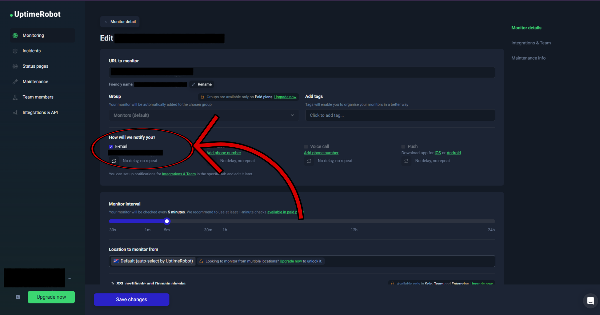

---

## Step 10: Adjust Polling Interval

While you have the edit panel open, consider increasing the **Monitoring Interval** from the default 5 minutes to around **10 minutes**.

This is a more conservative polling frequency that keeps your Render service from being pinged too frequently, reducing unnecessary load on the free tier instance.

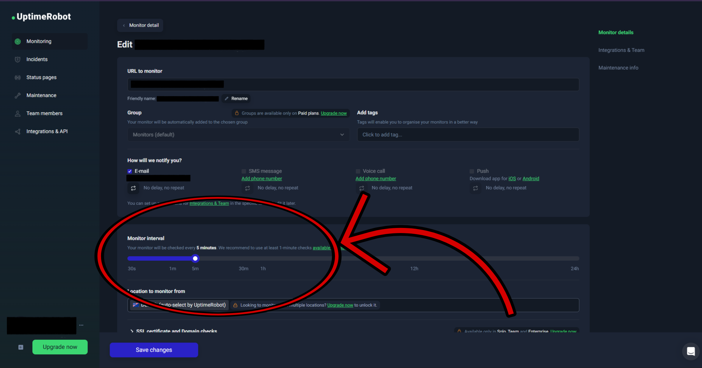

---

## Step 11: Save Your Changes

Once you've disabled email notifications and adjusted the polling interval, click **Save Changes**.

Your uptime monitor is now configured and active!

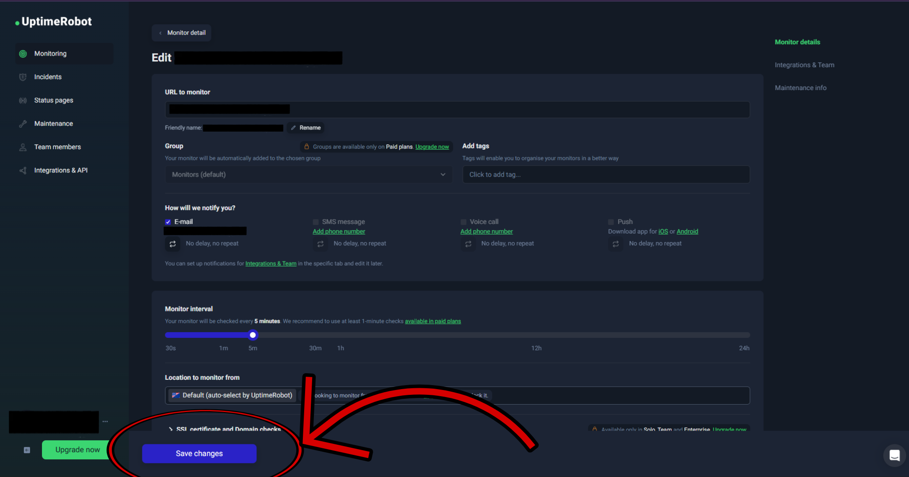

---

# 🔀 Alternate Flow

If after clicking **Start Monitoring in 30 Seconds** you were taken to a page with a **Website to Monitor** field and a **Create your account** section rather than the sign-up page, follow these steps instead.

---

### Step 1: Enter Your Website URL

In the **Website to Monitor** field, enter the URL of your deployed Render app.

> 🔗 **Where do I find my app's URL?**
> Refer back to **Step 12** of the [Render Deployment Guide](render-setup.md), where you copied and saved your app URL from the Render dashboard.

After entering the URL, either create a new account or sign in via Google — whichever you prefer.

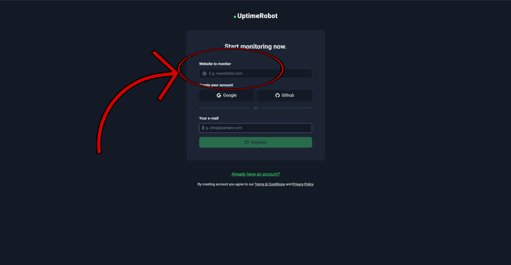

---

### Step 2: Close the Welcome Popup

You'll be taken directly to the dashboard. A popup will appear saying something like **"Good job, your first monitor is now running!"**

Go ahead and close it.

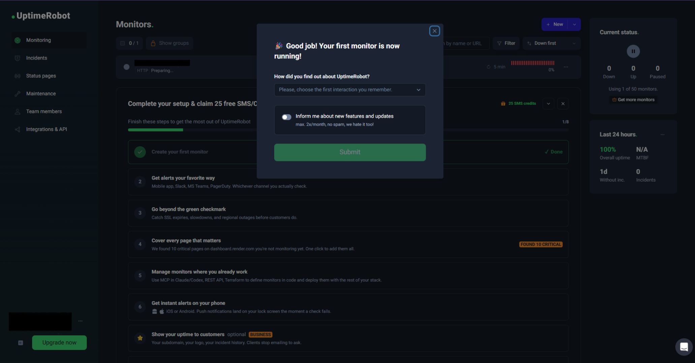

---

### Step 3: Click on Your Monitor

From the dashboard, click on the monitor that was automatically created for you.

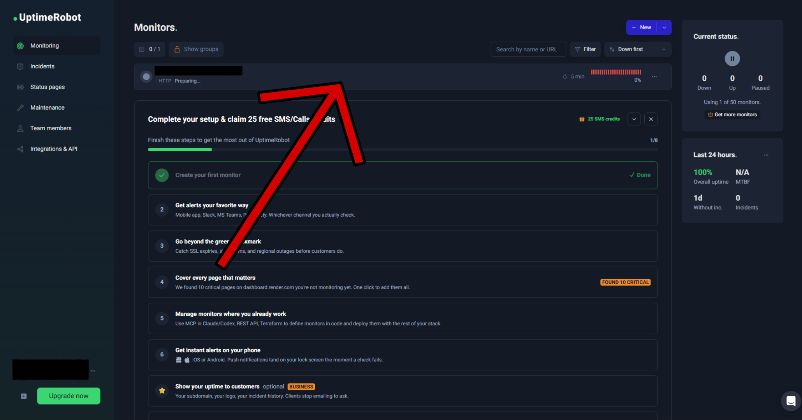

From here, your flow continues exactly the same as the main guide — head to [Step 8: Open Monitor Info & Edit](#step-8-open-monitor-info--edit) and follow the remaining steps from there.

---

# 🎉 Setup Complete

Your uptime bot is now running. UptimeRobot will ping your Render app at regular intervals to keep it active, without flooding your inbox with false failure alerts.

Your project is now fully set up end to end:

- ✅ Resend configured for email automation
- ✅ App deployed on Render
- ✅ Uptime bot keeping your app alive